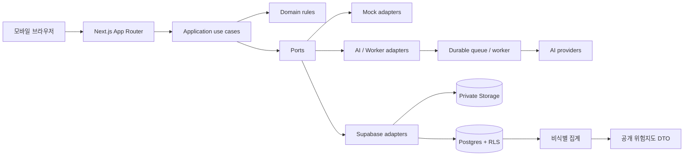

# 바로잡길 MVP 아키텍처

- 문서 상태: 구현 전 권장 설계
- 최종 갱신: 2026-09-06

## 1. 설계 목표

이 문서는 현재의 mock 기반 MVP에서 향후 Supabase와 실제 AI API로 이동할 때 UI와 도메인 로직을 크게 다시 쓰지 않도록 경계를 정의한다.

핵심 목표:

- 모바일 우선 App Router 화면과 서버 로직의 책임을 분리한다.
- AI 제안값, 사용자 확정값, 공개 지도 집계값을 구조적으로 분리한다.
- 긴 영상 분석을 재시도 가능한 비동기 작업으로 다룬다.
- mock, Supabase, 실제 AI가 같은 애플리케이션 계약을 구현하게 한다.
- 원본 미디어와 차량번호가 공개 경로로 새지 않게 한다.
- 자동 신고가 아키텍처상 발생할 수 없게 외부 신고 경계를 명확히 둔다.

## 2. 현재 프로젝트 기준

현재 저장소는 기본 `create-next-app` 구조이며 실제 기능은 아직 없다.

| 항목 | 현재 값 |
| --- | --- |
| Next.js | 16.3.4, App Router |
| React / React DOM | 19.2.8 |
| TypeScript | 5, `strict: true` |
| Tailwind CSS | 4 |
| 소스 루트 | `src/`, `@/* -> ./src/*` |
| 현재 검증 명령 | `npm run lint`, `npm run build` |

Next.js 코드를 작성하기 전에는 저장소에 설치된 `node_modules/next/dist/docs/`의 관련 문서를 다시 확인한다. 이 설계에 반영한 Next.js 16 기준은 다음과 같다.

- 페이지와 레이아웃은 기본적으로 Server Component다.
- 상태, 이벤트, File API, 미디어 플레이어, 지도 등 브라우저 기능이 필요한 작은 경계만 Client Component로 만든다.
- Server Component는 자체 Route Handler를 HTTP로 다시 호출하지 않고 server-only 데이터 계층을 직접 호출한다.
- Route Handler와 Server Action은 외부에서 호출 가능한 공개 경계로 보고 매번 인증·인가·입력 검증을 수행한다.
- 긴 작업은 서버리스 Route Handler에서 동기 처리하지 않는다.
- Next.js 16의 `params`, `searchParams`, `cookies()`, `headers()` 등 비동기 API와 생성 타입을 해당 시점의 로컬 문서대로 사용한다.
- 대용량 영상은 Server Action 본문으로 전달하지 않고, 브라우저가 비공개 객체 저장소로 직접 업로드하게 한다.

## 3. 전체 구성

`app`은 URL, 레이아웃, 로딩·오류 UI와 서버 데이터 조합만 담당한다. 업무 규칙은 순수 도메인과 use case에 두고 외부 기술은 포트 뒤에 둔다.



의존성 방향은 `UI -> application -> domain/ports <- infrastructure`로 고정한다. 도메인과 application은 Supabase SDK, AI SDK, React를 직접 알지 않는다.

## 4. 추천 디렉터리 구조

아래는 구현 시 생성할 권장 구조이며 현재 생성된 구조가 아니다.

```text
src/
  app/
    (public)/
      page.tsx
      risk-map/
        page.tsx
      privacy/
        page.tsx
    (workspace)/
      cases/
        page.tsx
        new/
          page.tsx
        [caseId]/
          page.tsx
          analyzing/
            page.tsx
          candidates/
            page.tsx
          review/
            page.tsx
          package/
            page.tsx
          loading.tsx
          error.tsx
    api/
      uploads/
        sign/route.ts
        complete/route.ts
      analyses/
        [jobId]/route.ts
      webhooks/
        ai/route.ts
      packages/
        [packageId]/download/route.ts
      risk-map/route.ts
      auth/
        callback/route.ts
    layout.tsx
    globals.css

  components/
    ui/

  features/
    upload/
    analysis-status/
    candidate-timeline/
    media-review/
    incident-facts/
    violation-review/
    evidence/
    report-package/
    delayed-report/
    risk-map/

  domain/
    report-case/
    violation/
    evidence/
    delayed-report/
    risk-map/

  application/
    ports/
    use-cases/
    dto/

  contracts/
    analysis-v1/
    public-api/

  infrastructure/
    mock/
    supabase/
    ai/

  server/
    auth/
    dal/
    env/
    container/

  mocks/
    fixtures/

supabase/
  migrations/
  seed/
```

### 폴더 책임

- `src/app`: 라우팅, 메타데이터, 서버 데이터 조합, loading/error boundary
- `src/components/ui`: Button, Field, Card, Dialog처럼 도메인을 모르는 재사용 UI
- `src/features`: 한 기능에 필요한 작은 Client Component, 폼, hook, 표시 컴포넌트
- `src/domain`: 순수 TypeScript 타입, 불변식, 상태 전이, 증거 및 지연 정책
- `src/application`: 사용 사례와 외부 의존성 포트, 화면에 필요한 최소 DTO
- `src/contracts`: AI 결과, webhook, 공개 응답의 버전형 런타임 스키마
- `src/infrastructure`: mock, Supabase, AI 제공자별 포트 구현
- `src/server`: `server-only` DAL, 세션 확인, 환경변수 검증, 구현체 조립
- `src/mocks/fixtures`: 번호판·얼굴·실제 위치가 없는 합성 fixture

큰 공용 `utils` 폴더에 업무 로직을 모으지 않는다. 특정 기능에서만 쓰는 코드는 해당 feature에 두고, 두 기능 이상에서 안정적으로 공유될 때만 domain 또는 공용 UI로 올린다.

## 5. 페이지와 라우팅

| 경로 | 책임 | 주 렌더링 |
| --- | --- | --- |
| `/` | 서비스 설명, AI 한계, 시작 CTA | Server |
| `/cases` | 사용자의 초안과 분석·지연 상태 목록 | Server |
| `/cases/new` | 파일 선택, 검증, 업로드 시작 | Server shell + Client uploader |
| `/cases/[caseId]` | 저장된 상태를 읽고 올바른 다음 단계로 재개 | Server |
| `/cases/[caseId]/analyzing` | 업로드·분석 진행, 후보 없음, 실패·재시도 | Server shell + polling/realtime Client |
| `/cases/[caseId]/candidates` | 영상 플레이어, 후보 타임라인, 핵심 구간 선택 | Server shell + Client interaction |
| `/cases/[caseId]/review` | 핵심정보 수정, 예상 유형, 근거, 신뢰도, 증거 체크 | Server + 작은 Client form |
| `/cases/[caseId]/package` | 최종 패키지, 문장 수정, 지연 상태, 외부 신고 버튼 | Server + Client countdown |
| `/risk-map` | 집계 지도와 필터, 개인정보 안내 | Server shell + Client map |
| `/privacy` | 처리 목적, 보존·삭제·동의 정책 | Server |

한 단계 URL에 직접 접근하더라도 서버가 소유권과 현재 상태를 확인한다. 선행 조건을 충족하지 않으면 접근 거부 또는 올바른 이전 단계로 이동시킨다. 클라이언트에서 버튼을 숨기는 것만으로 권한이나 상태 전이를 보호하지 않는다.

`/cases/[caseId]/page.tsx`는 상태를 기준으로 재개 지점을 결정한다. 단계별 데이터를 중복 저장하기보다 동일한 case와 draft를 각 화면이 읽게 한다.

### Route Handler 사용 범위

Route Handler는 다음처럼 실제 HTTP 경계가 필요한 경우에만 둔다.

- 업로드용 짧은 수명의 서명 발급과 업로드 완료 통지
- 클라이언트 분석 상태 폴링
- AI 제공자 webhook 수신
- 권한 확인이 필요한 패키지 다운로드
- 공개 지도용 최소 집계 DTO
- 향후 인증 callback

Server Component의 데이터 조회는 `/api`를 거치지 않고 DAL과 repository를 직접 호출한다. 모든 Route Handler는 인증·인가, 소유권, content type, 크기, 속도 제한, 오류 정제를 독립적으로 수행한다.

## 6. 애플리케이션 포트

최소 포트는 다음과 같다.

| 포트 | 책임 |
| --- | --- |
| `ReportCaseRepository` | case, 후보 선택, draft, 상태 전이 저장·조회 |
| `MediaStorage` | 비공개 업로드, 단기 읽기 권한, 파생 미디어, 삭제 |
| `AnalysisGateway` | 분석 작업 제출, 상태 조회, 결과 정규화 |
| `ReportPackageGenerator` | 확정 revision 기준 패키지 snapshot 생성 |
| `ReportDeadlinePolicy` | 사건 시각과 검증된 정책으로 마감 시각 계산 |
| `NotificationScheduler` | 지연 시점 알림 예약·취소; 신고 동작은 포함하지 않음 |
| `RiskAggregationRepository` | 동의된 기여값 반영과 공개 집계 조회 |
| `Clock` | 서버 기준 시각 주입과 지연 로직 테스트 |

예상 use case:

- `createCase`, `requestUpload`, `completeUpload`
- `enqueueAnalysis`, `applyAnalysisResult`, `retryAnalysis`
- `selectCandidate`, `adjustEvidenceRange`
- `confirmFacts`, `changeViolationType`, `assessEvidence`
- `generateReportDraft`, `generatePackage`
- `scheduleDelayedReport`, `cancelDelayedReport`, `getReportAvailability`
- `recordRiskMapConsent`, `publishRiskContribution`
- `deleteCase`

포트 인터페이스의 반환값은 DB row나 제공자 응답이 아니라 application DTO다.

## 7. 핵심 도메인 모델

### 7.1 타입

다음은 개념 계약이며 구현 시 런타임 스키마와 함께 정의한다.

```ts
type ViolationType =
  | "signal_violation"
  | "center_line_crossing"
  | "dangerous_cut_in"
  | "unknown";

type EvidenceItemStatus =
  | "satisfied"
  | "partial"
  | "missing"
  | "unknown"
  | "not_applicable";

type ValueSource =
  | "ai"
  | "metadata"
  | "user"
  | "system";

interface SuggestedValue<T> {
  value: T | null;
  confidence: number | null; // 0..1, AI 값일 때만
  source: ValueSource;
  observedAtMs?: number;
}

interface ConfirmedValue<T> {
  value: T | null;
  basedOnSuggestion: boolean;
  confirmedByUser: boolean;
  updatedAt: string;
}
```

AI 제안과 사용자 확정값은 같은 필드를 덮어쓰지 않는다. 신고 패키지는 `ConfirmedValue`만 snapshot하고, AI 화면은 원래 `SuggestedValue`와 비교해 보여준다.

### 7.2 상태

하나의 거대한 status 대신 독립 상태를 둬 불가능한 조합을 줄인다.

```ts
type CaseStage =
  | "draft"
  | "analysis"
  | "review"
  | "package_ready"
  | "archived";

type AnalysisStatus =
  | "not_requested"
  | "queued"
  | "processing"
  | "succeeded"
  | "failed";

type DelayedReportStatus =
  | "not_scheduled"
  | "waiting"
  | "available"
  | "completed_by_user"
  | "expired"
  | "cancelled";
```

중요 불변식:

- 분석 성공 전에는 후보를 선택할 수 없다.
- 신고 패키지당 선택 후보는 하나다.
- 사용자 확인을 거치지 않은 핵심정보로 최종 패키지를 만들 수 없다.
- `availableAt <= now < deadlineAt`일 때만 외부 신고 버튼을 활성화한다.
- 버튼 활성 여부는 서버 기준 시각으로 다시 검증한다.
- `completed_by_user`는 사용자가 직접 완료 사실을 표시할 때만 설정한다.
- 어떤 상태 전이도 안전신문고 제출을 실행하지 않는다.

## 8. 권장 데이터베이스 구조

모든 ID는 추측하기 어려운 UUID를 사용하고 시간은 UTC로 저장한다. 민감 row는 기본적으로 사용자 소유권과 RLS를 가진다.

| 테이블 | 주요 필드와 역할 |
| --- | --- |
| `profiles` | `id = auth.users.id`, 최소 사용자 설정, 생성·수정 시각 |
| `report_cases` | `id`, `owner_id`, case stage, `selected_candidate_id`, 보존·삭제 시각 |
| `media_assets` | `case_id`, 종류(original/clip/frame/plate_crop/package), private object path, MIME, bytes, duration, checksum, 검역·업로드 상태, `purge_at` |
| `analysis_jobs` | case/asset, status/progress, provider job ID, idempotency key, model/prompt/contract version, 안전한 오류 코드, 시각 |
| `violation_candidates` | job, 순서, `start_ms/end_ms`, 예상 유형, 탐지·분류 신뢰도, 참고 근거, private preview asset ID |
| `candidate_facts` | 후보별 AI 제안 차량번호·시각·좌표·주소, 값별 신뢰도·출처·관찰 시점 |
| `report_drafts` | 선택 후보, 사용자 확정 차량번호·시각·장소·유형·문장, revision, `confirmed_at` |
| `evidence_assessments` | draft revision, 유형, 전체 참고 상태, `rule_version`, 생성 시각 |
| `evidence_items` | assessment, 항목 코드, 상태, 설명, 근거 시작·종료 오프셋 |
| `report_packages` | 확정 draft revision snapshot, 핵심 미디어 asset, private manifest 경로, 생성 시각 |
| `delayed_report_schedules` | `available_at`, `deadline_at`, status, 알림 채널·시각, 정책 버전 |
| `consents` | 동의 유형, 정책 버전, 부여·철회 시각 |
| `risk_contributions` | 제한된 내부 계층. 동의 ID, 거친 공간·시간 bucket, 확인 유형, 철회용 source token |
| `risk_aggregates` | 공개 가능한 cell, 기간 bucket, 유형, count/위험 지표, 산식 버전 |
| `audit_events` | 상태 변경 주체와 시각, 이벤트 코드. 민감 원문은 저장하지 않음 |

### 데이터 분리 원칙

1. `candidate_facts`는 AI 원본 제안이다.
2. `report_drafts`는 사용자가 신고에 쓸 값이다.
3. `report_packages`는 특정 draft revision의 변경 불가능한 snapshot이다.
4. `risk_contributions`는 case와 분리된 제한 원천/가명처리 계층이며 공개 데이터가 아니다.
5. 외부에 공개하는 것은 최소 표본 수를 충족한 `risk_aggregates` DTO뿐이다.

AI 제공자의 원본 JSON이 디버깅에 필요하다면 일반 조회 테이블과 분리하고 접근·보존 기간을 더 엄격히 한다. UI는 검증·정규화된 필드만 읽는다.

## 9. mock 우선 전략

초기 구현에서는 다음 구성값으로 구현체만 교체한다. 이름은 예시이며 서버 전용 환경변수로 둔다.

- `DATA_BACKEND=mock | supabase`
- `AI_BACKEND=mock | provider`

mock 원칙:

- `MockAnalysisGateway`도 실제 `AnalysisResultV1` 계약과 런타임 검증을 통과한다.
- fixture는 복수 후보, 후보 없음, 필드 누락, 낮은 신뢰도, 분석 실패, 사진 시나리오를 포함한다.
- 고정 seed와 가상 Clock을 사용해 테스트 결과가 매번 같게 한다.
- 실제 차량번호, 얼굴, 주소, 영상 URL을 fixture에 넣지 않는다.
- 사용자가 고른 로컬 파일은 현재 탭의 미리보기 object URL로만 사용하고 사용 후 해제한다.
- 실제 원본을 base64로 변환해 source, localStorage, 로그에 보관하지 않는다.
- 영속 저장소가 없는 mock 데모에서는 새로고침 후 복원을 보장하지 않으며 이 한계를 UI와 테스트에서 명시한다.

## 10. Supabase 연결 설계

### 10.1 Auth

- 모든 case는 처음부터 `owner_id`를 가진다.
- 구체적인 로그인 UX는 제품 결정 전이지만 서버가 검증한 세션 없이는 민감 데이터를 조회하지 않는다.
- 페이지 가드뿐 아니라 DAL, Server Action, Route Handler의 모든 읽기·변경에서 소유권을 확인한다.
- 로그인 방식이 정해지면 쿠키 기반 서버 세션을 사용하고 인증 callback만 Route Handler에 둔다.

### 10.2 Postgres와 RLS

- 사용자는 `owner_id = auth.uid()`인 case와 자식 데이터만 조회·변경할 수 있다.
- 자식 테이블 정책은 요청 row의 case 소유권까지 확인한다.
- service role은 AI worker, 보존 삭제, 집계 작업처럼 꼭 필요한 서버 환경에만 둔다.
- 브라우저가 service-role key를 받는 경로를 만들지 않는다.
- 공개 지도는 별도 view 또는 RPC가 집계 열만 반환하게 하고 원천 테이블 권한을 주지 않는다.
- 삭제, 동의 철회, 분석 callback은 함수 또는 transaction으로 원자적으로 반영한다.

### 10.3 Storage

권장 private bucket:

- `evidence-originals`
- `evidence-derived`
- `report-packages`

흐름:

1. 서버가 사용자, case, 파일 선언값, quota를 확인한다.
2. 짧은 수명의 업로드 권한과 예측 불가능한 object path를 발급한다.
3. 브라우저가 Storage로 직접 업로드한다. 대용량 영상은 재개 가능한 업로드를 사용한다.
4. 완료 통지 뒤 파일을 격리 상태로 둔다.
5. 서버/worker가 실제 MIME 또는 magic bytes, 크기, 영상 길이, checksum을 확인한다.
6. 검증을 통과한 asset만 분석 큐에 넣는다.

DB에는 공개 URL이 아니라 object path만 저장한다. 읽기용 서명 URL은 짧게 만료되며 요청 때 발급한다. 원본, 썸네일, 번호판 crop, 패키지는 권한 확인 후 `Cache-Control: private, no-store`로 제공하고 공유 이미지 최적화 캐시에 넣지 않는다.

## 11. AI 분석 연결 설계

### 11.1 단계

분석을 재시도·관찰 가능한 단계로 나눈다.

1. `preflight`: 미디어 검증, 메타데이터 파싱
2. `candidate_detection`: 전체 영상 후보 탐색
3. `fact_extraction`: 번호판 OCR, 시각, 위치 후보 추출
4. `violation_classification`: 지원 3종과 unknown 분류
5. `evidence_assessment`: 유형별 관찰 체크리스트 평가
6. `report_draft_generation`: 사실 중심 문장 초안 생성
7. `package_generation`: 사용자 확인 뒤 핵심 미디어와 snapshot 생성

패키지 생성은 AI 분석 작업과 분리한다. 사용자가 값을 수정한 뒤 최신 revision으로 다시 생성할 수 있어야 하기 때문이다.

### 11.2 버전형 계약

`AnalysisResultV1`은 최소한 다음을 포함한다.

- `schemaVersion`, `jobId`, 처리 상태
- 후보 배열과 각 `startMs/endMs`
- 예상 유형, 탐지 신뢰도, 분류 신뢰도
- 관찰 사실 중심 참고 근거
- 차량번호·시각·장소 제안과 필드별 신뢰도·출처
- evidence item 코드, 상태, 근거, 관련 구간
- provider, model, prompt, rules version

외부 AI 출력은 신뢰하지 않는다. webhook payload와 결과를 런타임 스키마로 검증하고, enum·길이·범위·시간 구간·신뢰도 값을 정규화한 뒤에만 저장한다. 잘못된 결과는 안전한 오류 코드와 함께 실패 처리하고 그대로 UI에 렌더링하지 않는다.

### 11.3 비동기 처리 흐름

1. 업로드 완료 use case가 고유 idempotency key로 `analysis_jobs`를 만든다.
2. 내구성 있는 queue 또는 분석 제공자에 job을 제출한다.
3. 전용 worker가 짧은 signed URL로 필요한 원본에 접근한다.
4. 가능한 경우 전체 원본 대신 필요한 프레임·구간만 각 AI 제공자에 보낸다.
5. provider callback은 webhook 서명, timestamp, replay 방지 값을 검증한다.
6. 결과는 provider job ID와 idempotency key로 한 번만 반영한다.
7. UI는 Supabase Realtime 또는 제한된 polling으로 상태를 갱신한다.
8. timeout, 일시 오류는 횟수 제한과 backoff를 두고 재시도하며 영구 실패는 사용자에게 복구 행동을 제공한다.

Next.js는 작업 시작·상태 조회·webhook 경계만 담당한다. 영상 디코딩, ffmpeg, 장시간 모델 호출은 별도 worker에서 처리한다.

### 11.4 AI 개인정보 경계

- AI 키는 서버 또는 worker에만 둔다.
- 제공자별 데이터 보존, 모델 학습 사용, 처리 지역, 하위 처리자를 출시 전에 검토한다.
- 업무에 필요하지 않은 음성, 얼굴, 주변 차량 정보는 보내지 않거나 사전 마스킹한다.
- 요청·응답 로그에서 차량번호, 정확 주소, signed URL을 제거한다.
- 사용자의 지도 제공 동의는 AI 처리 동의나 서비스 필수 처리의 근거로 재사용하지 않는다.

## 12. 증거 충족도 설계

AI가 관찰 사실을 추출하고, 버전형 규칙이 위반 유형별 체크리스트를 계산한다. 법률 결론을 모델의 자유 형식 문장 하나에 맡기지 않는다.

- 관찰값: 신호 색, 차선/중앙선, 차량 궤적, 관련 시점 등
- 규칙: 유형별 필요한 관찰 조합과 상태 계산
- 결과: item별 `satisfied/partial/missing/unknown`과 설명
- 표시: `증거가 충분해 보임/추가 확인 필요/부족/판단 불가`

규칙에는 `ruleVersion`, 근거 출처, 검수일을 둔다. 사용자가 위반 유형을 바꾸면 같은 관찰값에 새 유형 규칙을 적용한다. 법령이나 공식 신고 기준 변경 시 기존 결과를 조용히 바꾸지 않고 재평가 여부를 명시한다.

## 13. 안전 지연 신고 설계

`availableAt`과 `deadlineAt`은 다른 개념이다.

- `availableAt`: 사용자가 요청한 버튼 활성 시각
- `deadlineAt`: 검증된 신고 기간 정책이 계산한 참고 마감 시각

서버는 `now < availableAt < deadlineAt` 조건으로 예약을 검증한다. 클라이언트 카운트다운은 표시용이며, 페이지 재진입과 외부 이동 직전에 서버 기준 시각과 상태를 다시 확인한다.

상태를 갱신하기 위해 필수적으로 cron을 돌릴 필요는 없다. 조회 시 서버가 현재 시각으로 `waiting/available/expired`를 계산할 수 있다. 향후 알림이 필요할 때만 `NotificationScheduler`와 별도 예약 worker를 연결한다. 이 worker는 알림과 상태 갱신만 하며 신고 자료 전송 권한을 갖지 않는다.

신고 가능 기간은 변경되거나 상황별 예외가 있을 수 있으므로 숫자를 코드에 고정하지 않는다. 정책은 출처, 관할, 버전, 검수일, 적용 시작일을 갖고 출시 전 법률·운영 검토를 거친다.

외부 신고 버튼은 allowlist로 검증된 안전신문고 공식 URL만 열며 사용자가 직접 첨부·제출한다. 서비스는 안전신문고 계정 정보나 비밀번호를 저장하지 않는다.

## 14. 교통위험지도 개인정보 설계

데이터 흐름:

1. 사용자가 지도 제공에 별도로 동의한다.
2. 사용자가 유형·장소를 확인한 case만 제한 원천의 후보가 된다.
3. 사용자 ID, 차량번호, 미디어, 신고 문장, 정확 주소·좌표·시각을 제거한다.
4. 위치를 충분히 큰 격자/도로 구간으로, 시간을 넓은 구간으로 일반화한다.
5. 최소 표본 수와 재식별 위험 검사를 통과한 셀만 집계한다.
6. 공개 API는 `cell/period/type/count`와 설명 가능한 지표만 반환한다.
7. 지도는 개별 마커가 아니라 격자 또는 heatmap으로 표시한다.

`risk_contributions`는 공개 익명 데이터가 아니라 접근이 제한된 가명처리 중간 계층이다. 외부에는 최소 표본 임계값을 통과한 `risk_aggregates`만 노출한다. 격자 크기, 시간 bucket, 최소 표본 수, 철회 후 재집계 방식은 개인정보 검토 후 확정한다.

## 15. 캐시와 데이터 노출

- 사용자 case, 분석 결과, 원본·파생 미디어 응답은 기본적으로 private/no-store다.
- 사용자별 데이터에 정적 공개 캐시를 적용하지 않는다.
- 공개 집계 지도만 정책 버전과 갱신 주기에 맞춰 캐시할 수 있다.
- URL과 query string에 차량번호, 정밀 좌표, 미디어 path를 넣지 않는다.
- Client Component에는 화면에 필요한 최소 직렬화 DTO만 전달한다.
- 서버 전용 모듈은 `server-only` 경계를 사용해 Client bundle 유입을 빌드 단계에서 막는다.
- 오류 응답은 사용자 행동에 필요한 코드만 반환하고 provider 원문, SQL, object path를 숨긴다.

## 16. 보안 통제

- 모든 변경 요청에 세션, 소유권, 현재 상태, 입력 스키마를 확인한다.
- 업로드 서명, 분석 시작, 상태 polling, 다운로드, webhook에 rate limit과 quota를 둔다.
- webhook은 서명, 허용 timestamp, nonce 또는 이벤트 ID로 위조와 replay를 막는다.
- CSRF와 동일 출처 정책을 mutation 방식에 맞게 적용한다.
- 신고 문장과 AI 설명은 신뢰하지 않는 텍스트로 보고 HTML 삽입을 금지하거나 정제한다.
- Storage object path는 사용자 입력으로 직접 조합하지 않는다.
- 로그는 case/job의 불투명 ID와 오류 코드 중심으로 남기며 민감값을 구조적으로 차단한다.
- 사용자 삭제 시 DB row, 원본, 파생 미디어, 패키지, 대기 job을 함께 삭제 또는 폐기한다.
- 보존 삭제와 동의 철회 작업은 감사 가능한 이벤트를 남기되 민감 원문은 남기지 않는다.

## 17. 테스트 전략

현재 테스트 러너는 설치되어 있지 않으므로 문서 변경 시에는 `npm run lint`와 `npm run build`가 기본 검증이다. 기능 구현 때 다음 계층을 도입한다.

| 계층 | 주요 검증 |
| --- | --- |
| 단위 | 상태 전이, 시간대·deadline 경계, 증거 규칙, DTO redaction, 문장 생성의 누락값 처리 |
| 계약 | mock과 실제 adapter가 같은 포트·`AnalysisResultV1`을 만족하는지 |
| 컴포넌트 | 후보 선택, 필드 출처 표시, 접근성, 지연 카운트다운 |
| 통합 | RLS 소유권, private Storage, signed URL 만료, webhook 멱등성과 replay 방지 |
| E2E | 업로드→분석→후보→수정→패키지→지연→외부 이동 전 확인 |

E2E에서는 안전신문고를 가짜 목적지로 대체하고 실제 외부 제출을 절대 수행하지 않는다. Next.js 로컬 가이드가 async Server Component에는 E2E 테스트를 권장하므로 서버 렌더링 흐름은 E2E 비중을 높인다.

## 18. 단계별 전환

### 단계 1: mock UI

- 합성 fixture와 mock ports로 전체 사용자 흐름 구현
- 상태와 오류 시나리오, 모바일 UX, 안전 문구 검증
- 사용자 원본은 영속 저장하지 않음

### 단계 2: Supabase 기반 저장

- Auth 방식 결정, migration과 RLS 추가
- private Storage 직접 업로드와 보존 삭제 추가
- repository만 mock에서 Supabase adapter로 교체

### 단계 3: 비동기 AI

- queue/worker, `AnalysisResultV1`, callback 보안 추가
- mock과 실제 AI 결과의 계약 테스트
- 모델·규칙 평가와 품질 모니터링

### 단계 4: 지연 알림과 위험지도

- 검증된 신고 기간 정책과 선택한 알림 채널 연결
- 동의·가명처리·집계·철회 파이프라인 검증
- 최소 표본 기준을 충족한 집계만 공개

## 19. 구현 전 결정 사항

- 로그인 방식과 비회원 사용·계정 연결 정책
- 지원 파일 형식, 최대 크기·길이, quota
- 원본, 파생물, AI 원본 응답, 패키지의 보존 기간
- 영상 처리 worker와 queue 운영 방식
- AI 제공자, 처리 지역, 보존·학습 사용 정책
- 위치 추출·지도 검색 제공자와 API 키 노출 정책
- 공식 신고 가능 기간 산정 규칙과 검수 책임자
- 지연 기본값, 알림 채널, 다른 기기 동기화 범위
- 안전신문고 공식 URL 및 앱 딥링크 정책
- 지도 격자·시간 단위, 최소 표본 수, 위험 지표 산식
- 동의 철회 시 기존 집계 재계산 방식
- 신고 패키지 파일 형식과 핵심 영상 인코딩 규격

이 항목은 구현 과정에서 임의로 결정하지 않고 제품·법률·개인정보·운영 검토 후 문서와 버전형 정책으로 확정한다.
